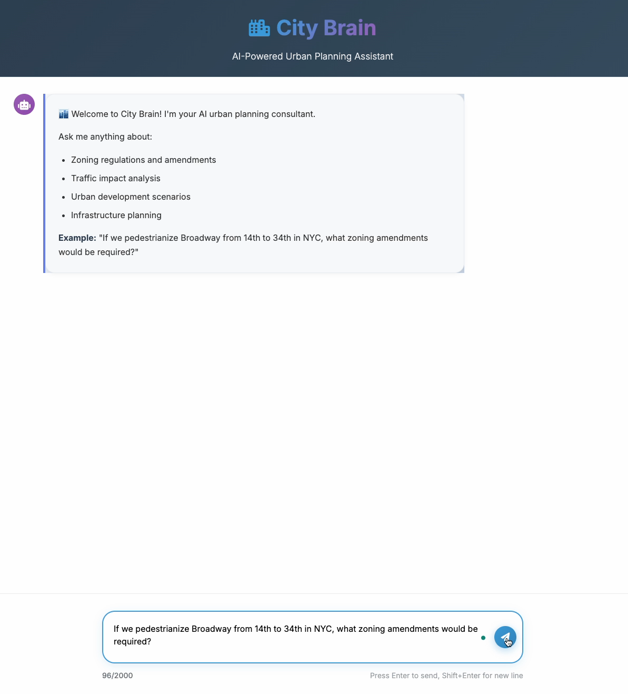

# CityBrain

Minimal scaffolding for the "City Brain" NYC urban planning simulator.



## Quickstart

1. **Create a virtualenv and install deps:**
```bash
python3 -m venv .venv && source .venv/bin/activate
pip install -r requirements.txt
```

2. **Configure environment:**
```bash
cp .env.example .env
# Fill in API keys and dataset IDs as needed
```

3. **Deploy the Modal app:**
```bash
modal deploy citybrain/modal_app.py
```

4. **Start the backend proxy server:**
```bash
cd citybrain/frontend
python backend_proxy.py
```

5. **Open the frontend:**
- Navigate to `http://localhost:5001` in your browser
- Get AI-powered analysis using Llama 3

## Architecture

- **Frontend**: Modern chat interface (HTML/CSS/JS) served by Flask backend proxy
- **Backend**: Flask proxy that bridges frontend and Modal CLI
- **Inference**: Modal-hosted Llama 3 model for urban planning analysis
- **Data**: NYC zoning, traffic, and geospatial data (when retrieval is enabled)

## Development

- **Local ingestion**: `python scripts/local_ingest.py`
- **Modal ingestion**: `modal run citybrain/modal_app.py::ingest_all_data`
- **Test retrieval**: `python scripts/test_scenario.py`
- **Test Modal**: `modal run citybrain/modal_app.py::get_scenario_insights --user-query "test query"`

